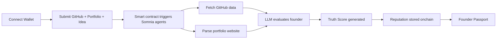
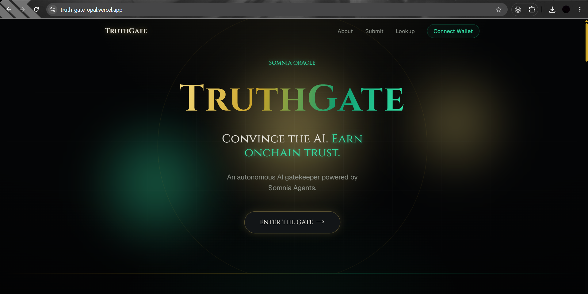
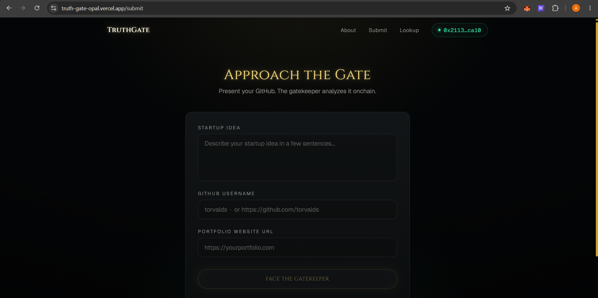
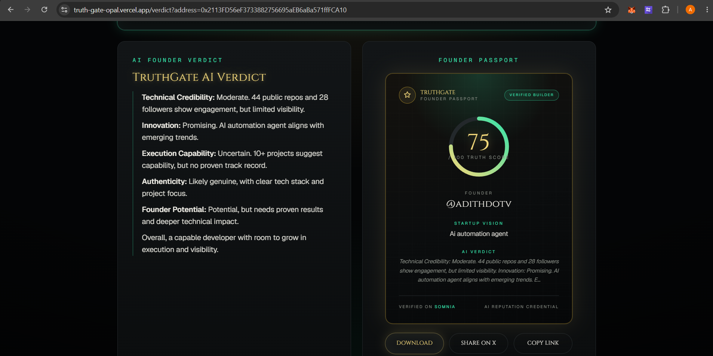
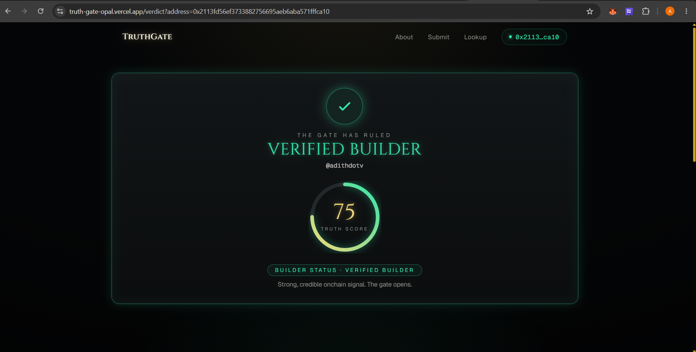

<div align="center">

# 🛡️ TruthGate

### *Enter the Gate. Prove Your Truth.*

**A decentralized, AI-powered reputation protocol built on Somnia.**
An autonomous AI gatekeeper that evaluates founders and builders from their real internet footprint — and writes a verifiable **Truth Score** onchain.

<br/>


**[🚀 Live Demo](https://truth-gate-opal.vercel.app)** · **[🎥 Demo Video](#-demo-video)** · **[🏛️ Architecture](#-architecture)** · **[📖 How It Works](#-how-it-works)**

</div>

---

## 📍 Overview

TruthGate turns a builder's real internet footprint into a **portable, AI-verified, onchain credential**.

A user submits three things — **a GitHub username, a portfolio URL, and a startup idea** — and a single onchain transaction triggers a fleet of autonomous Somnia AI agents that gather data, parse the portfolio, reason over the evidence, and commit a verdict to the chain.

**Inputs**

| Field | Purpose |
| --- | --- |
| GitHub Username | Developer activity & credibility signals |
| Portfolio Website | Project proof, achievements, real tech stack |
| Startup Idea | Vision & founder ambition |

**Outputs — a Founder Passport**

| Output | Description |
| --- | --- |
| **Truth Score** | A 0–100 trust signal, stored onchain |
| **Trust Tier** | Low · Moderate · Verified Builder |
| **AI Verdict** | A founder evaluation across five dimensions |
| **Portfolio Summary** | AI-generated analysis of the portfolio |
| **Detected Tech Stack** | Technologies extracted from the portfolio |

---

## ❗ Problem

The internet has **no trustworthy reputation layer for builders.**

Investors, hackathon judges, DAOs, accelerators, and communities are forced to rely on:

- 🪪 Self-reported claims
- 📄 Inflated resumes
- 🌐 Unverified portfolios
- 💬 Subjective opinions

> [!IMPORTANT]
> There is no universal, verifiable way to evaluate a founder's credibility — and reputation never travels between ecosystems.

---

## ✅ Solution

TruthGate creates a **decentralized reputation passport** powered by AI and blockchain. It combines:

- **GitHub credibility** — real developer activity, not vanity metrics
- **Portfolio analysis** — what the builder has actually shipped
- **Startup idea evaluation** — vision and ambition
- **AI founder assessment** — a defensible, multi-dimensional verdict

…into a single transparent, verifiable, **onchain** reputation profile.

---

## 🌟 Key Features

- 🤖 **Autonomous multi-agent analysis** — three distinct Somnia agent types, consensus-backed
- 🔗 **Fully onchain reputation** — tamper-proof, composable, readable by any contract
- 🧠 **AI founder verdict** — technical credibility, innovation, execution, authenticity, potential
- 🎬 **Cinematic Oracle UX** — animated multi-stage analysis and verdict reveal
- 🪪 **Shareable Founder Passport** — PNG export, X/Twitter share, dynamic OG preview, QR
- 🛡️ **Resilient by design** — fail-forward + permissionless timeout finalize, so analysis never hangs
- 🔍 **Reputation lookup** — revisit any builder's result by wallet address

---

## 🏛️ Architecture

<div align="center">


</div>

> A single user transaction fans out into **7 onchain agent requests** across three agent types. Each is resolved by a validator subcommittee; results stream back via callbacks, and the contract autonomously escalates from raw data → AI verdict → AI score → finalized Truth Score.

<details>
<summary><b>Layers at a glance</b></summary>

| Layer | Tech | Responsibility |
| --- | --- | --- |
| Frontend | Next.js 16 · React 19 · Tailwind v4 · ethers v6 | UI, wallet, tx orchestration, polling, sharing |
| Smart Contract | Solidity (`TruthGateOracle`) | Orchestrate agents, store reputation, compute Truth Score |
| AI Agents | Somnia JSON API · Website Parser · LLM | Gather data, parse sites, reason + score |
| Network | Somnia Agentic L1 | Consensus-backed autonomous agent execution |

Full write-up: **[docs/ARCHITECTURE.md](docs/ARCHITECTURE.md)**

</details>

---

## 📖 How It Works



1. User connects wallet *(MetaMask · Somnia Shannon testnet)*
2. User submits GitHub username, portfolio URL, and startup idea
3. The smart contract triggers Somnia AI agents
4. GitHub data is fetched · portfolio website is parsed · tech stack extracted
5. The LLM evaluates founder credibility and produces a verdict + score
6. The **Truth Score** is generated and the reputation is stored **onchain**

---

## 🤝 Somnia AI Agents

TruthGate orchestrates three distinct agent types. Every request is resolved by a **3-validator subcommittee** that reaches consensus before anything is written onchain.

| Agent | Role |
| --- | --- |
| 🔢 **JSON API Agent** | Fetches verifiable GitHub data — followers, following, repositories, account metadata |
| 🌐 **Website Parser Agent** | Analyzes the portfolio — builder profile extraction, tech-stack detection |
| 🧠 **LLM Agent** | Founder evaluation — innovation, execution capability, authenticity, founder potential |

---

## 📜 Smart Contract

Built in **Solidity** (`contracts/TruthGate.sol`), the `TruthGateOracle` orchestrates the agent pipeline and stores all reputation data onchain:

- Truth Score & Trust Tier
- AI Verdict
- Startup Idea
- Portfolio Summary
- Detected Tech Stack
- GitHub Metrics (followers, following, repos)

> [!NOTE]
> The contract is **self-driving**: a callback-based state machine advances the analysis (data → verdict → score → finalize) with no further user input, and `forceFinalize()` guarantees a stalled analysis can always be completed.

---

## 🖥️ Frontend

Built with **Next.js 16, React 19, Tailwind CSS v4, ethers v6, and MetaMask.**

- Wallet connection, network detection & switching
- Multi-stage AI analysis flow with live progress
- Cinematic oracle experience & animated verdict reveal
- Dynamic, shareable Founder Passport cards
- X/Twitter sharing + dynamic OG image

---

## 🎬 Product Experience

The app is designed as a cinematic AI Oracle experience:

```
Landing  →  Submit Profile  →  AI Analysis  →  Oracle Verdict  →  Truth Score  →  Share Reputation
```

| Route | Purpose |
| --- | --- |
| `/` | Landing — the pitch & narrative |
| `/submit` | Submit a profile & run the onchain analysis |
| `/verdict` | The verdict reveal — score + AI verdict + passport |
| `/passport/:address` | Full shareable Founder Passport |
| `/lookup` | View any existing result by wallet address |

---

## 🖼️ Screenshots

| Landing | Submit Profile |
| --- | --- |
|  |  |
| **Oracle Verdict** | **Founder Passport** |
|  |  |

---

## 🎥 Demo Video

> 📺 **[Watch the demo](#)** — _add your demo video link here (YouTube / Loom)._

---

## 🧪 Example Output

<div align="center">

> ### 🛡️ TruthGate Founder Passport
>
> **Founder:** Adith V
> **GitHub:** 43 Public Repositories · 28 Followers
> **Detected Stack:** React · Next.js · TypeScript · Node.js · Solidity · Web3
> **Startup Idea:** Autonomous AI-Powered Freelance Execution Marketplace
>
> **AI Verdict:** *Trustworthy Builder with High Potential*
>
> ## Truth Score: 92 / 100 — ✅ Verified Builder

</div>

---

## ⚡ Why Somnia

TruthGate leverages **Somnia's AI Agent ecosystem** to build a fully decentralized trust layer.

> [!IMPORTANT]
> Without Somnia, data collection, portfolio analysis, and LLM evaluation would all require **centralized infrastructure**. Somnia enables **autonomous onchain intelligence** — the entire pipeline runs trustlessly, with consensus.

---

## 🥇 Competitive Advantage

| Traditional Reputation | TruthGate |
| --- | --- |
| ❌ Manual review | ✅ Automated by agents |
| ❌ Subjective | ✅ AI-powered scoring |
| ❌ Centralized | ✅ Decentralized |
| ❌ Not portable | ✅ Portable onchain |
| ❌ Unverifiable | ✅ Verifiable by anyone |

---

## 🎯 Use Cases

`Hackathons` · `Startup Accelerators` · `Grant Programs` · `DAOs` · `Developer Communities` · `Hiring Platforms` · `Freelance Platforms` · `Investor Screening`

---

## 🧱 Tech Stack

| Category | Technologies |
| --- | --- |
| **Network** | Somnia Agentic L1 (Shannon Testnet) |
| **Smart Contracts** | Solidity · Somnia Agents |
| **Frontend** | Next.js 16 · React 19 · Tailwind CSS v4 |
| **Web3** | ethers.js v6 · MetaMask |
| **Sharing** | html-to-image · react-qr-code · dynamic OG images |
| **Tooling** | react-hot-toast · Vercel Analytics |

---

## 🛣️ Future Roadmap

- [ ] **Blended Truth Score** — combine the LLM score with deterministic on-chain signals
- [ ] **Reputation NFT** — mint the passport as a transferable credential
- [ ] **Composability SDK** — let any contract gate access by Truth Score
- [ ] **Multi-source signals** — X, on-chain history, contribution graphs
- [ ] **Re-analysis & history** — track reputation over time
- [ ] **Mainnet deployment**

> **Vision:** become the **trust layer of the internet** — a decentralized reputation passport for founders, developers, freelancers, creators, and startups, where trust is portable, verifiable, and onchain.

---

## 🚀 Installation

```bash
# 1. Clone
git clone https://github.com/adithdotv/truth-gate.git
cd truth-gate

# 2. Install dependencies
npm install

# 3. Configure environment (see below)
cp .env.example .env.local   # then edit values

# 4. Run the dev server
npm run dev
```

Open **[http://localhost:3000](http://localhost:3000)**, connect a wallet on the Somnia Shannon testnet, and step through the gate.

---

## 🔧 Environment Variables

Create a `.env.local` in the project root:

```bash
# Required — the deployed TruthGate oracle
NEXT_PUBLIC_CONTRACT_ADDRESS=0xYourDeployedContract

# Optional — defaults to the Somnia Shannon testnet
NEXT_PUBLIC_SOMNIA_CHAIN_ID=50312
NEXT_PUBLIC_SOMNIA_RPC=https://dream-rpc.somnia.network
NEXT_PUBLIC_SOMNIA_EXPLORER=https://shannon-explorer.somnia.network

# Optional — public site URL used for shareable links / OG image
NEXT_PUBLIC_SITE_URL=https://truth-gate-opal.vercel.app
```

> [!NOTE]
> `NEXT_PUBLIC_CONTRACT_ADDRESS` is **required** — the app reads the contract from this value (no committed default). You'll also need **STT** test tokens to cover the analysis deposit and gas.

---

## 📡 Contract Address

| Network | Chain ID | Contract | Explorer |
| --- | --- | --- | --- |
| Somnia Shannon Testnet | `50312` | `NEXT_PUBLIC_CONTRACT_ADDRESS` | [shannon-explorer.somnia.network](https://shannon-explorer.somnia.network) |

> Set the deployed address in your environment and (for production) in your Vercel project settings.

---

## 🌐 Live Demo

**🔗 [truth-gate-opal.vercel.app](https://truth-gate-opal.vercel.app)**

Connect a Somnia-funded wallet, submit a GitHub profile, and watch the Gatekeeper render its verdict.

---

## 👥 Team

| Name | Role |
| --- | --- |
| **Adith V** ([@adithdotv](https://github.com/adithdotv)) | Founder · Full-Stack & Smart Contract Engineer |

> _Add additional contributors here._

---

## 📄 License

Released under the **MIT License**. See [`LICENSE`](LICENSE) for details.

---

<div align="center">

### 🛡️ TruthGate

**Enter the Gate. Prove Your Truth.**

Built on **Somnia**.

</div>
