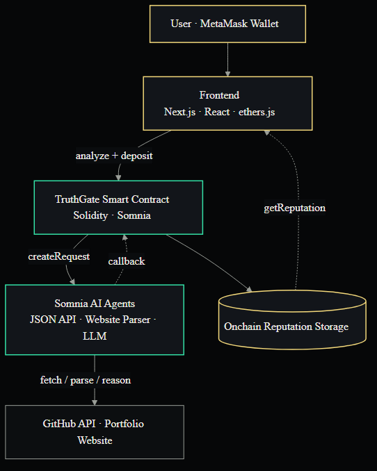
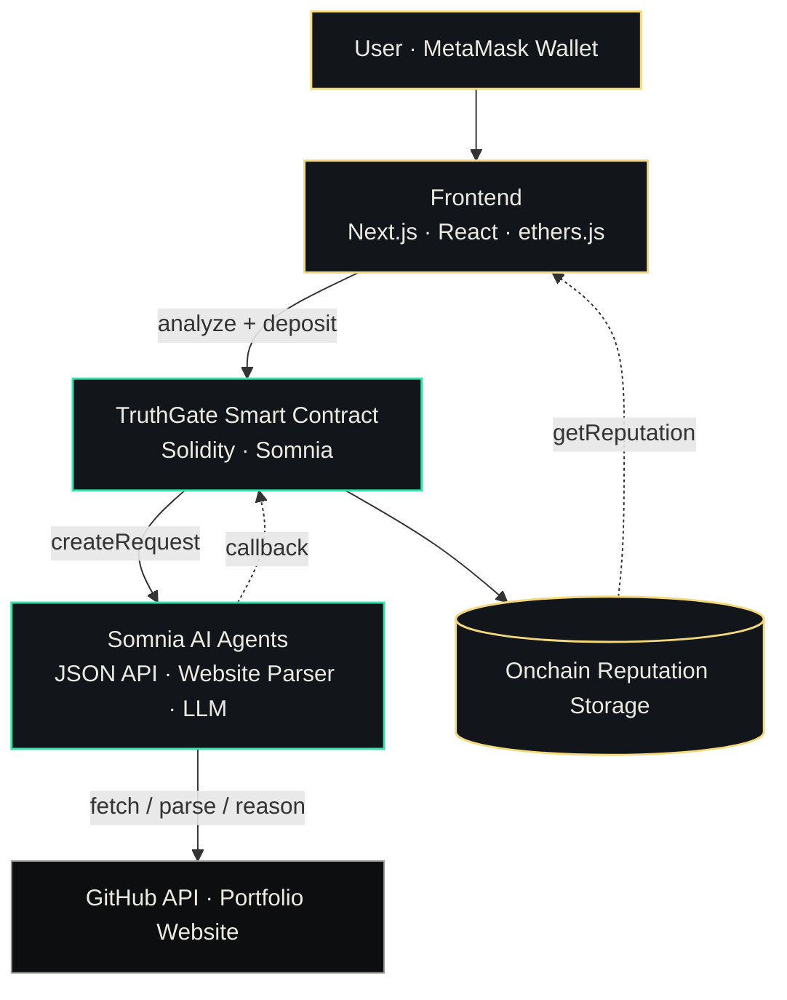

# TruthGate — Architecture

TruthGate is a decentralized, AI-powered founder reputation protocol on **Somnia**.
A single user transaction triggers autonomous onchain agents that gather data, reason
over it, and write a verifiable **Truth Score** onchain.

## System diagram





## Request → response cycle

1. **Submit** — the builder connects MetaMask (Somnia Shannon testnet) and submits a
   GitHub username, portfolio URL, and startup idea. The frontend sends the payable
   `analyzeCompleteProfile(...)` transaction with the required deposit.
2. **Fan-out** — `TruthGateOracle.sol` calls the Somnia Agent Platform to create the
   data requests (GitHub metrics + portfolio parse), each resolved by a validator
   subcommittee.
3. **Callbacks** — agents return via `handleResponse`, which stores each field and
   autonomously escalates: raw data → AI verdict → AI score → finalize.
4. **Read & render** — the frontend polls `getReputation(address)` (read-only RPC, so
   it works on refresh and without a wallet) until `analyzed` is true, then renders the
   verdict and the shareable Founder Passport.

## Resilience

- **Fail-forward** — a failed agent leg is marked complete with fallback data so the
  pipeline never stalls on a single failure.
- **Permissionless timeout finalize** — `forceFinalize(user)` lets anyone complete a
  stalled analysis after a timeout (using a deterministic on-chain fallback score), so
  the flow can never hang on a missing callback.

## Layers

| Layer | Tech | Responsibility |
| --- | --- | --- |
| Frontend | Next.js 16 · React 19 · Tailwind v4 · ethers v6 | UI, wallet, tx orchestration, polling, sharing |
| Smart contract | Solidity (`TruthGateOracle`) | Orchestrate agents, store reputation, compute Truth Score |
| Agents | Somnia JSON API / Website Parser / LLM | Gather data, parse sites, reason + score |
| Network | Somnia Agentic L1 | Consensus-backed autonomous agent execution |

## Regenerate the diagram

```bash
npx -y @mermaid-js/mermaid-cli -i docs/architecture.mmd -o docs/architecture.png -b "#060708" -w 1400
```
